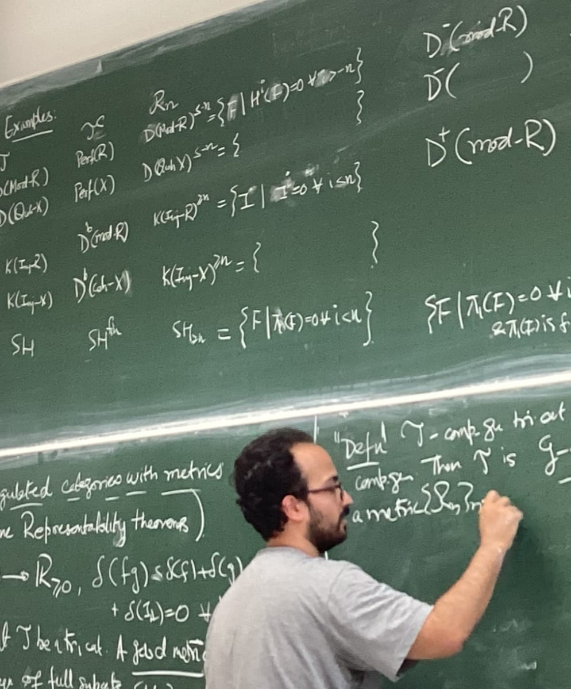

## Kabeer Manali Rahul

<figure>
    
</figure>

I am currently a postdoc at Bonn where my mentor is [Daniel Huybrechts](https://www.math.uni-bonn.de/~huybrech/). Before that, I did my PhD at the Australian National University under the supervision of [Amnon Neeman](https://maths.anu.edu.au/people/amnon-neeman). Most of my research is on derived and triangulated categories in the context of algebraic geometry. Recently, I have been working with derived categories arising in noncommutative algebraic geometry too.

### Papers/Preprints

* Bounded t-structures, finitistic dimensions, and singularity categories of triangulated categories, with [Rudradip Biswas](https://sites.google.com/view/rudradip-biswas/home), [Hongxing Chen](https://math.cnu.edu.cn/FACULTY/qtjs2/szmjs/C/038c83671eff4baea4d6c9f48e3ece22.htm), [Chris J. Parker](https://www.math.uni-bielefeld.de/birep/person.php?name=Chris+Parker), and [Junhua Zheng](https://www.iaz.uni-stuttgart.de/en/institute/team/Zheng-00002/). Preprint available at [arXiv:2401.00130](https://arxiv.org/abs/2401.00130).
* Classification and nonexistence results for tensor t-structures on derived categories of schemes, with [Alexander Clark](https://sites.google.com/site/alexanderpclarkmath/), [Pat Lank](https://patlank.com/), and [Chris J. Parker](https://www.math.uni-bielefeld.de/birep/person.php?name=Chris+Parker). Preprint avaliable at [arXiv:2404.08578](https://arxiv.org/abs/2404.08578). 
* Approximability and Rouquier dimension for noncommuative algebras over schemes, with [Timothy De Deyn](https://tdedeyn.github.io/) and [Pat Lank](https://patlank.com/). Preprint avaliable at [arXiv:2408.04561](https://arxiv.org/abs/2408.04561).
* Descent and generation for noncommutative coherent algebras over schemes, with [Timothy De Deyn](https://tdedeyn.github.io/) and [Pat Lank](https://patlank.com/). Preprint avaliable at [arXiv:2410.01785](https://arxiv.org/abs/2410.01785). 
* Integral transforms on singularity categories for Noetherian schemes, with [Uttaran Dutta](https://sites.google.com/view/uttaran-dutta/home) and [Pat Lank](https://patlank.com/). Preprint avaliable at [arXiv:2501.13834](https://arxiv.org/abs/2501.13834). 
* Descending strong generation in algebraic geometry, with [Timothy De Deyn](https://tdedeyn.github.io/) and [Pat Lank](https://patlank.com/). Preprint avaliable at [arXiv:2502.08629](https://arxiv.org/abs/2502.08629). 
* Regularity and bounded t-structures for algebraic stacks, with [Timothy De Deyn](https://tdedeyn.github.io/), [Pat Lank](https://patlank.com/), and [Fei Peng](https://au.linkedin.com/in/fei-peng-02762a1b9). Preprint avaliable at [arXiv:2504.02813](https://arxiv.org/abs/2504.02813). 
* Representability theorems via metric techniques. Preprint avaliable at [arXiv:2504.11768](https://arxiv.org/abs/2504.11768). 
* Admissible subcategories and metric techniques. Preprint avaliable at [arXiv:2504.11772](https://arxiv.org/abs/2504.11772). 
* Quasi-perfect blowups detect regularity, with [Timothy De Deyn](https://tdedeyn.github.io/) and [Pat Lank](https://patlank.com/). Preprint avaliable at [arXiv:2508.10845](https://arxiv.org/abs/2508.10845). 
* Measuring birational derived splinters, with [Timothy De Deyn](https://tdedeyn.github.io/), [Pat Lank](https://patlank.com/), and [Sridhar Venkatesh](https://sites.google.com/view/sridhar-venkatesh). Preprint avaliable at [arXiv:2510.26648](https://arxiv.org/abs/2510.26648).
* Nonexistence of singly compactly generated t-structures for schemes, with [Anirban Bhaduri](https://anirbanbhaduri.com/), [Timothy De Deyn](https://tdedeyn.github.io/), [Pat Lank](https://patlank.com/), and [Michal Hrbek](https://sites.google.com/view/michalhrbek/home). Preprint avaliable at [arXiv:2511.01622](https://arxiv.org/abs/2511.01622). 

### Conferences/Summer schools/masterclasses attended
* Geometric aspects of algebraic varieties, IISER Mohali, 17-19 March 2025
* Tale of Geometries, Université libre de Bruxelles, 28-30 October 2024
* Masterclass on Derived Category Methods in Ring Theory. Aarhus University, 13-16 August 2024.
* Summer School on Interactions between Algebra, Equivariance, and Homotopy Theory. Universität Regensburg, 24-28 June 2024.
* Purity, Approximation Theory and Spectra. Cetraro, 13-17 May 2024.
* Workshop on Finitistic Dimensions. Universität Bielefeld, 15-16 June 2023.  
* Categories, clusters, and completions master class. Aarhus University, 22-24 March 2023.
* Tensor Categories in Sydney. University of Sydney, 28 Nov-2nd Dec 2022.

Email: kabeermr "dot" maths "at" gmail "dot" com

Photo by: Rudradip Biswas
